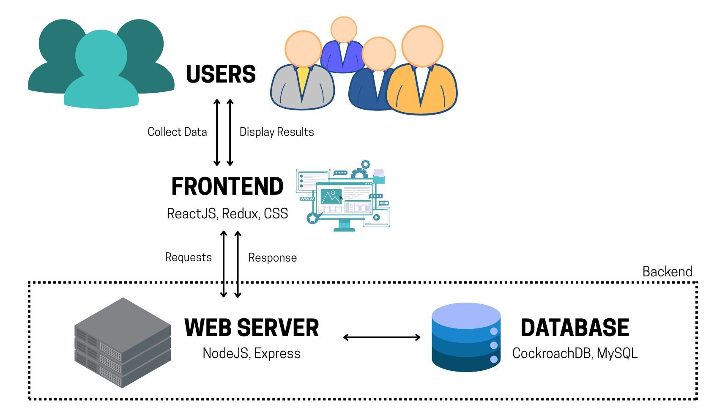
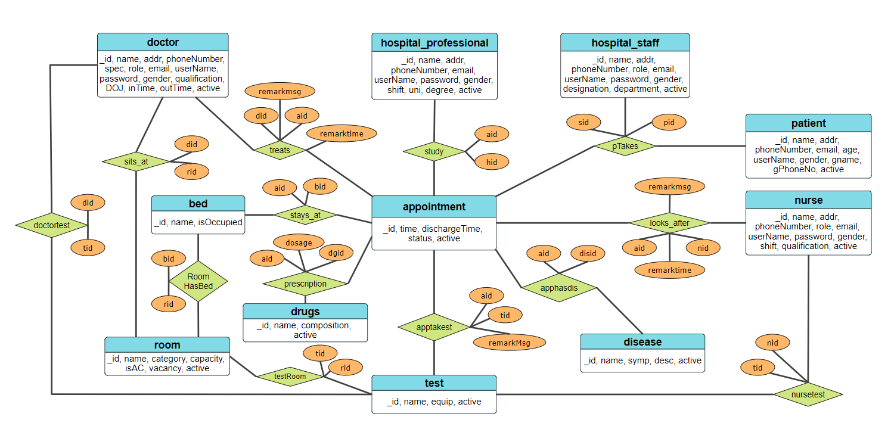

# Hospital Management System

A full-stack Hospital Management System with a structured relational database and a responsive web interface. Built to streamline hospital operations like patient appointments, doctor scheduling, room assignments, and test/drug tracking.

## Table of Contents
- [Features](#features)
- [Setup Instructions](#setup-instructions)
- [Tech Stack](#tech-stack)
- [ER Diagram](#er-diagram)
- [Frontend Routes](#frontend-routes)
- [API Endpoints](#api-endpoints)
- [ENV Format](#env-format)
  - [Frontend](#frontend)
  - [Backend](#backend)
- [Contributors](#contributors)

## Features
- Manage doctors, nurses, hospital staff & professionals
- Administer patients, appointments, beds, and room allocations
- Track prescriptions, drugs, and tests
- Test and disease management with assigned doctors and nurses
- Handles shifts, roles, specializations, and departments
- Web-based interface for easy interaction

## Setup Instructions
**Backend Github repo:**
https://github.com/sauravatgithub-web/hospital_sql_server.git

**Frontend Github repo:**
https://github.com/SNprime24/hospital_frontend.git
- Clone the repositories of the backend and the frontend
- Install the required library by using the command `npm install`
- Add `.env` file in frontend and backend separately as specified [below](#env-format).
- Run the backend and frontend repositories separately by typing the command `npm start`

## Tech Stack


## ER Diagram


## Frontend Routes

The application uses **React Router v6** for client-side routing. Here's an overview of all frontend routes and their access control:

**Public Route**

| Path   | Component     | Description                 |
|--------|---------------|-----------------------------|
| `/`    | `FrontPage`   | Login page for Employees   |

> Protected using `<ProtectRoute user={!user} />` → redirects to `/app` if already logged in.

**Main Authenticated Area**

> Protected using `<ProtectRoute user={user} />` → redirects to `/` if not authenticated.

| Path                                  | Component                 | Description                        |
|---------------------------------------|----------------------------|------------------------------------|
| `/app`                                | Role-based main page:     | Redirects to respective dashboard: |
|                                       | - `DoctorMainPage`        | For Doctors                        |
|                                       | - `NurseMainPage`         | For Nurses                         |
|                                       | - `FDOMainPage`           | For Front Desk Operators (FDO)     |
|                                       | - `DEOMainPage`           | For Data Entry Operators (DEO)     |
| `/app/patient/:patientID`            | `SubRootLayout`           | Patient dashboard root             |
| `/app/form/:type/:entity`           | `EntityForm` / `Navigate` | Form view for creating/editing entities; role-specific access |
|                                       |                            | - `DEO`: Full access               |
|                                       |                            | - `FDO`: Limited form access       |
|                                       |                            | - Others: Redirect to `/unauthorized` |

**Error Handling**

| Route Area        | Component     | Description              |
|-------------------|---------------|--------------------------|
| All routes        | `ErrorPage`   | Generic fallback UI      |

> **Note:** All authenticated routes (`/app`) are dynamically rendered based on user roles using conditional logic within `ProtectRoute` and route children.

## API Endpoints

All endpoints are prefixed with `/api/v1/`.

**Authentication**
| Method | Endpoint                   | Description                  |
|--------|----------------------------|------------------------------|
| POST   | `/auth/login`              | User login                   |
| POST   | `/auth/verifyEmail`        | Send OTP to email            |
| POST   | `/auth/verifyOTP`          | Verify OTP                   |
| POST   | `/auth/setPassword`        | Set new password             |
| GET    | `/auth/me`                 | Get current user profile     |
| GET    | `/auth/logOut`             | Log out user                 |

**Appointments**
| Method | Endpoint                                 | Description                    |
|--------|------------------------------------------|--------------------------------|
| GET    | `/appointment/all`                       | Get all appointments           |
| GET    | `/appointment/this/:id`                  | Get appointment by ID          |
| GET    | `/appointment/currentAppointments`       | Get current appointments       |
| POST   | `/appointment/new`                       | Create new appointment         |
| PUT    | `/appointment/update`                    | Update appointment details     |
| PUT    | `/appointment/discharge`                 | Discharge a patient            |
| DELETE | `/appointment/delete`                    | Delete an appointment          |

**Diseases**
| Method | Endpoint                    | Description           |
|--------|-----------------------------|-----------------------|
| GET    | `/disease/all`              | Get all diseases      |
| GET    | `/disease/this/:id`         | Get disease by ID     |
| POST   | `/disease/new`              | Create new disease    |
| PUT    | `/disease/update`           | Update disease info   |
| PUT    | `/disease/delete`           | Delete disease entry  |

**Doctors**
| Method | Endpoint                       | Description               |
|--------|--------------------------------|---------------------------|
| GET    | `/doctor/all`                  | Get all doctors           |
| GET    | `/doctor/this/:id`             | Get doctor by ID          |
| GET    | `/doctor/appointments`         | Get doctor appointments   |
| POST   | `/doctor/new`                  | Create new doctor         |
| PUT    | `/doctor/update`               | Update doctor info        |
| DELETE | `/doctor/delete`               | Delete doctor             |

**Drugs**
| Method | Endpoint                  | Description         |
|--------|---------------------------|---------------------|
| GET    | `/drug/all`               | Get all drugs       |
| GET    | `/drug/this/:id`          | Get drug by ID      |
| POST   | `/drug/new`               | Add new drug        |
| PUT    | `/drug/update`            | Update drug info    |
| DELETE | `/drug/delete`            | Delete drug entry   |

**Hospital Professionals**
| Method | Endpoint                    | Description                   |
|--------|-----------------------------|-------------------------------|
| GET    | `/hp/all`                   | Get all professionals         |
| GET    | `/hp/this/:id`              | Get professional by ID        |
| POST   | `/hp/new`                   | Add new professional          |
| PUT    | `/hp/update`                | Update professional info      |
| DELETE | `/hp/delete`                | Delete professional           |

**Hospital Staff**
| Method | Endpoint                          | Description                   |
|--------|-----------------------------------|-------------------------------|
| GET    | `/hs/all`                         | Get all staff                 |
| GET    | `/hs/this/:id`                    | Get staff by ID               |
| GET    | `/hs/currentDoctors`              | Get current doctors           |
| GET    | `/hs/currentNurses`               | Get current nurses            |
| GET    | `/hs/currentAppointments`         | Get current appointments      |
| POST   | `/hs/new`                         | Add new staff member          |
| PUT    | `/hs/update`                      | Update staff info             |
| DELETE | `/hs/delete`                      | Delete staff member           |

**Nurses**
| Method | Endpoint                 | Description         |
|--------|--------------------------|---------------------|
| GET    | `/nurse/all`             | Get all nurses      |
| GET    | `/nurse/this/:id`        | Get nurse by ID     |
| POST   | `/nurse/new`             | Add new nurse       |
| PUT    | `/nurse/update`          | Update nurse info   |
| DELETE | `/nurse/delete`          | Delete nurse        |

**Patients**
| Method | Endpoint                        | Description             |
|--------|---------------------------------|-------------------------|
| GET    | `/patient/all`                  | Get all patients        |
| GET    | `/patient/this/:id`             | Get patient by ID       |
| GET    | `/patient/:phoneNo`             | Get patient by phone    |
| POST   | `/patient/new`                  | Add new patient         |
| PUT    | `/patient/update`               | Update patient info     |
| DELETE | `/patient/delete`               | Delete patient          |

**Rooms & Beds**
| Method | Endpoint                               | Description           |
|--------|----------------------------------------|-----------------------|
| GET    | `/room/all`                            | Get all rooms         |
| GET    | `/room/this/:id`                       | Get room by ID        |
| GET    | `/room/allVacantRooms`                 | List all vacant rooms |
| GET    | `/room/bed/allVacantBeds`              | List all vacant beds  |
| POST   | `/room/new`                            | Add new room          |
| PUT    | `/room/update`                         | Update room info      |
| DELETE | `/room/delete`                         | Delete room           |

**Tests**
| Method | Endpoint               | Description         |
|--------|------------------------|---------------------|
| GET    | `/test/all`            | Get all tests       |
| POST   | `/test/new`            | Add new test        |
| PUT    | `/test/update`         | Update test info    |
| DELETE | `/test/delete`         | Delete test         |

## ENV Format

#### Frontend

| Variable Name          | Description                        |
|------------------------|------------------------------------|
| `REACT_APP_SERVER_URL` | Base URL of the backend API server |

```env
REACT_APP_SERVER_URL=http://localhost:5000/api/v1
```

#### Backend

| Variable Name       | Description                                      |
|---------------------|--------------------------------------------------|
| `COCKROACH_DB_URL`  | Connection string for CockroachDB                |
| `PORT`              | Port number on which the backend runs |
| `JWT_SECRET`        | Secret key used for signing JWT tokens           |
| `CLIENT_URL`        | Frontend base URL  |
| `ADMIN_EMAIL`       | Default admin email |
| `ADMIN_PASS`        | Default admin password |
| `ADMIN_ID`          | Unique ID assigned to admin |
| `ADMIN_SECRET`      | Internal secret for admin-level operations |

```env
COCKROACH_DB_URL    = your_database_url_here
PORT                = 5000
JWT_SECRET          = your_jwt_secret_here
CLIENT_URL          = http://localhost:3000
ADMIN_EMAIL         = admin@example.com
ADMIN_PASS          = your_admin_password
ADMIN_ID            = admin123
ADMIN_SECRET        = your_admin_secret
```

## Contributors
- Saurav Singh (22CS01010)
- Suprit Naik (22CS01018)
- Om Prakash Behera (22CS01041)
- Harsh Maurya (22CS01046)
